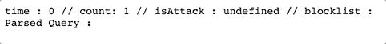

# sampleNodeHttpServer

Node.js의 Native module만을 활용하 간단한 http server 구성 실습.

## 주제

- 서비스 거부 공격에 대한 방어
- 간단한 라우팅
- 쿼리 해석

## Demo

### Query Parsing

- **url :** http://localhost:3001/about?id=abc123&power=567&isBlahBlah

### DoS Block (Simple Logic)

- **url :** http://localhost:3001/

